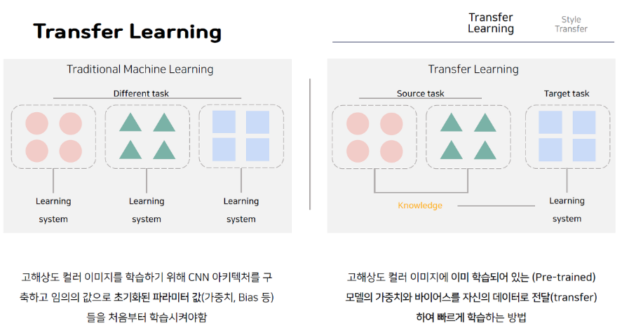

# Style Transfer 논문정리

* paper:[Style Transfer](https://ieeexplore.ieee.org/document/7780634)

    

# 01. Pre-trained Model
- MNIST(0~9를 나타내는 흑백 이미지)를 높은 정확도로 인식하기 위해서는 최소 3개의 Convolution layer와 1개의 fully connected layer가 필요하며 이때 전체 학습에 소요되는 시간은 1개의 CPU 환경에서 약 1시간 10분 소요

    

    

    

    

    

    

    

# 08. Style Transfer
- 스타일 전송을 위해서 사전 학습된(Pre-trained) CNN 모델을 사용합니다. (특징 추출 모델로 VGG19를 사용했습니다.)
- 네트워크의 가중치를 고정시키고 이미지를 변경시키는 방법을 사용합니다.
- 아래 사진과 같이 이미지를 업데이트하여 원하는 정보를 입힙니다.

    

    

    

    

# 12. Style Loss
- 스타일(Style)은 서로 다른 특징(feature) 간의 상관관계(correlation)을 의미합니다.
- Gij = 특징 i와 특징 j의 상관관계(correlation)
- 논문에서는 스타일은 서로 다른 특징들간의 상관관계로 정의합니다. 두 이미지의 스타일이 같다라는 말은 "두 이미지에 존재하는 특징들의 상관관계 정도가 유사하다." 라고 말할 수 있겠습니다.
- 상관관계를 수치적으로 표현하기 위해서 Gram Matrix를 사용합니다.

- 스타일 손실(Style loss)은 두 이미지의 특징 상관관계를 유사하게 만들어줍니다.
- 일반적으로 3~4개 정도의 레이어에서 Gram Matrix를 구해 유사해지도록 진행이 됩니다.
- 각 레이어 손실값에 가중치를 줄 수 있는 하이퍼 파라미터가 존재합니다.

    

    

    

    

    

